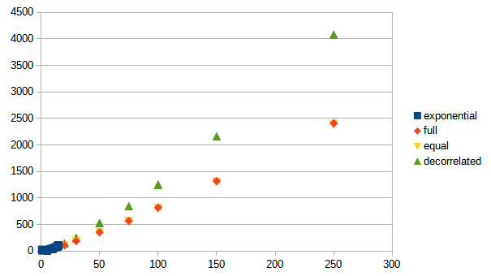
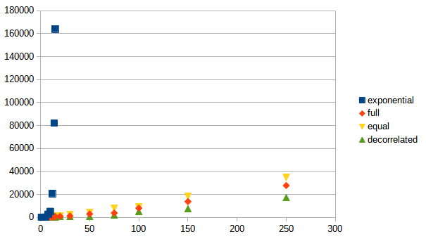

# エクスポネンシャル・バックオフとジッターの実装

## 実験

- リクエストは1件ずつしか処理できない
- リクエスト処理時間は平均10ミリ秒、誤差は4ミリ秒
- バックオフの初期値は5ミリ秒
- バックオフの上限なし

競合するようにリクエストを発行するクライアント数（client）を増やしたとき、すべてのクライアントの処理が完了するまでにかかる時間（time）と総試行回数（work）の変化を測定した。

### 各実装ごとの結果

#### exponential

指数関数的にバックオフ時間を長くする。

実装：`exponetial.js`

| client | time(ms) | work |
|:------:|:--------:|:----:|
| 1 | 23 | 1 |
| 5 | 193 | 10 |
| 8 | 2657 | 35 |
| 10 | 5194 | 45 |
| 12 | 20580 | 66 |
| 14 | 82063 | 91 |
| 15 | 163983 | 105 |

クライアント数20以上は長くなりすぎるので実施しなかった。

#### full

指数関数的にバックオフ時間のベースは長くするが、ランダム値を取り込む。
以下の式を参考。

```
sleep  = random_between(0, min(cap, base * 2 ** attempt))
```

実装：`full.js`

| client | time(ms) | work |
|:------:|:--------:|:----:|
| 1 | 25 | 1 |
| 5 | 278 | 19 |
| 8 | 243 | 34 |
| 10 | 324 | 41 |
| 12 | 330 | 53 |
| 14 | 552 | 73 |
| 15 | 849 | 80 |
| 20 | 911 | 109 |
| 30 | 1195 | 189 |
| 50 | 2959 | 354 |
| 75 | 3813 | 568 |
| 100 | 8040 | 818 |
| 150 | 13775 | 1319 |
| 250 | 27776 | 2408 |

#### equal

指数関数的にバックオフ時間のベースは長くするが、半分ほどランダム値を取り込む。
以下の式を参考。

```
temp = min(cap, base * 2 ** attempt)
sleep = temp / 2 + random_between(0, temp/2)
```

| client | time(ms) | work |
|:------:|:--------:|:----:|
| 1 | 12 | 1 |
| 5 | 155 | 15 |
| 8 | 375 | 30 |
| 10 | 518 | 50 |
| 12 | 308 | 53 |
| 14 | 993 | 70 |
| 15 | 953 | 76 |
| 20 | 1024 | 110 |
| 30 | 2394 | 183 |
| 50 | 4604 | 351 |
| 75 | 7901 | 561 |
| 100 | 9138 | 805 |
| 150 | 18193 | 1302 |
| 250 | 34653 | 2392 |

#### decorrelated

前回のバックオフ時間を参考にしつつ、ランダム値を取り込む。
以下の式を参考。

```
sleep  = min(cap, random_between(base, sleep * 3))
```

| client | time(ms) | work |
|:------:|:--------:|:----:|
| 1 | 16 | 1 |
| 5 | 159 | 20 |
| 8 | 219 | 41 |
| 10 | 302 | 53 |
| 12 | 613 | 70 |
| 14 | 478 | 89 |
| 15 | 371 | 103 |
| 20 | 655 | 146 |
| 30 | 692 | 250 |
| 50 | 717 | 528 |
| 75 | 2155 | 844 |
| 100 | 5123 | 1253 |
| 150 | 7627 | 2159 |
| 250 | 17154 | 4078 |

### まとめ

横軸がクライアント数（client）、縦軸が総試行回数（work）または処理時間（time）

#### 総試行回数



- exponentialは測定した部分では同じくらいだが、おそらくダメ（処理時間がかかりすぎるので測定していない）
- fullとequalはほぼ同じで優秀
- decorrelatedはfullおよびequalよりも劣る

#### 処理時間



- exponentialは全くダメ
- 他3つは概ね同じだがdecorrelated、full、equalの順で優秀

